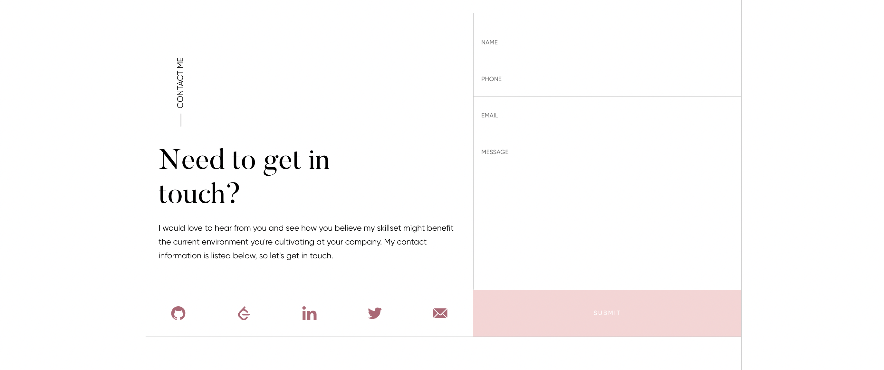

  

  <h2>Resume Website</h2>
  

    This Personal Resume Website is a project created in July 2022 in order to illustrate my full-stack development skills surrounding Web Application Development and Design in a React.js environment. 
  

 

# Table of Contents

- [Background](#background) 
- [Tech Stack](#techstack) 
- [Feature List](#features) 
  - [Mobile & Desktop Friendly Navbar](#responsive-navbar) 
  - [Multiple Calls to Action](#calls-to-action) 
  - [Marquee to Mosaic](#marquee) 
  - [Rotating Testimonial Carosel](#carosel) 
  - [Dynamically Created Components](#dynamically-created-components) 
  - [Modal for Further Information](#modal) 
  - [Email Sends on Form Submit](#email-on-submit) 
- [Running the App](#running-the-app) 
  - [Branch environments](#environments) 
  - [Steps to install](#install-the-app) 
  - [Steps to run tests](#test-the-app) 
  - [Steps to Deploy](#deploying-the-app) 
- [Future Features](#futurefeatures) 
- [Screenshots](#screenshots) 
- [Need to Contact Me?](#contact) 
- [Credits](#credits) 

# Background

Back in 2018, when I first moved to the West Coast, I was informed by a recruiter I was working with that having a Resume Website on-hand and live could be a crucial piece to my job-hunt journey in that new world.

While heeding her advice, I discovered that I had no free time to dedicate building a website front-to-back so I ended up whipping up a quick web page in the popular CMS, Squarespace. This website served its purpose for what I needed at the time, however I have been looking to replace it with something custom since first going-live on my domain "www.jennapalmer.info".

That is where this project steps in. I'm creating this project utilizing much of what I've learned over these last 5 years, working as a Full-Stack Software Engineer on several high-profile clients. I hope that upon its completion, this website will be a shining example of what I am personally capable of, and how I would go about solving complicated problems with well-rounded solutions.

<a href="#table-of-contents">...Back to Top</a>

# Tech Stack

This project was written using the following tech stack:

- React.js (Functional Components)
- Styled Components
- Typescript

Additional testing tech that was also included is:

- Jest
- React Testing Library
- Cypress

Regarding deployment: this application is hosted and deployed via pipelines within the Github environment. The domain itself is hosted on GoDaddy.

<a href="#table-of-contents">...Back to Top</a>

# Feature List

This project features the following features:

## Mobile & Desktop Friendly Navbar

Renders as a hamburger menu on mobile, and when expanded wide enough, removes the hamburger and displays a list of available menu pages.

## Multiple Calls to Action

There are several buttons throughout the website that link to the 'Contact' section in order to streamline getting the user in contact with the author.

## Marquee to Mosaic

The mobile version of the Skills Section shows several of the skills tiles rotating on a marquee. The desktop version completely removes this marquee, and instead renders a mosaic of tiles that stay squares when resizing the page width.

## Rotating Testimonial Carousel

The Testimonial page has a carosel of testimonials that automatically scrolls through each of the available quotes every 10 seconds.

## Dynamically Created Components

Several sections illustrate the utilization of dynamically rendered components, however the Work History section is the bext example of them all. All job history is stored in an array of objects, and this array is used to dynamically create each job listing.

This means, that the modals created for each Job are also dynamically rendered.

## Modal for Further Information

Users who want more information on a specific piece of job history, can click on the trigger "READ MORE" and see a modal filled with extended information surrounding the author's participation in that role.

## Email Opens Drafted Email

In the Contact section there is a form, and this form actively sends the author an email with the added information.

<!--  -->

<a href="#table-of-contents">...Back to Top</a>

# Future Features

These are features that may be developed one day, but are not currently under development:

## Database and API for Content

I would like to create an online database that I am able to automatically update with any updates, changes, or removals from my resume information. I would like my website to pull its data from this database, so that upon a successful API call the website is updated accordingly.

## Resume Generator (for Personal Use)

Given that I have all of my website content provided on a single file, I would love to create a terminal form that allows me to custom generate a Resume given varying requirements. This would assist me during future interviews because it would allow me to possibly cater my resume to fit what the team needs at that time. (This could also be a cover letter generator!)

## Resume Generator (for Website)

If I already have the logic to generate a resume, might as well add a "Download my Resume HERE" button to the website. This would download the most generic version of my resume.

<a href="#table-of-contents">...Back to Top</a>

# Running the Application

This section outlines what you would need to do in order to pull, and run, this React-based application.

## Branch environments

COMING SOON

## Steps to install

Ensure you have the latest version of `npm` and `node` installed onto your machine before running the following commands.

1. Clone this repo to your local machine.
2. Install dependencies: `npm i`
3. Launch application: `npm start`

## Steps to run tests

Ensure you have your project properly installed and able to be run before running the following commands.

- Unit and Integration Tests: `npm test`
- End-to-End Tests: `npm run test:e2e`

## Steps to Deploy

To deploy to Netlify, you simply have to merge your new branch into main. Any new commits in the Github will result in a new deployment on Netlify. Because of this, be sure to create feature branches rather than pushing straight to main.

<a href="#table-of-contents">...Back to Top</a>

# Application Screenshots

<a href="#table-of-contents">...Back to Top</a>

# Need to Contact Me?

If you have any comments, questions, or concerns regarding this project, feel free to reach out to me via the information below:

**Jenna Palmer**  
jcpalmer108@gmail.com 
[www.jennapalmer.info](https://www.jennapalmer.info) 

I'd love to hear any suggestions or feedback you may have too! Thanks for visiting my Github.

<a href="#table-of-contents">...Back to Top</a>

# Credits

I'd like to credit my designer [hardikgonyada](https://www.fiverr.com/hardikgondhiya) for creating wonderful mocks for me. I found them via Fiverr, the platform for freelance artists, and would highly recommend Hardik's work to anyone looking for design on a tech-based product.

I would also like to credit the following open-source projects I am utilizing in this application:

- [React Fast Marquee](https://www.npmjs.com/package/react-fast-marquee)
- [React Spring](https://react-spring.dev/)
- [Docx](https://https://docx.js.org/#/)

<a href="#table-of-contents">...Back to Top</a>

